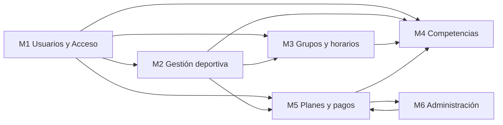
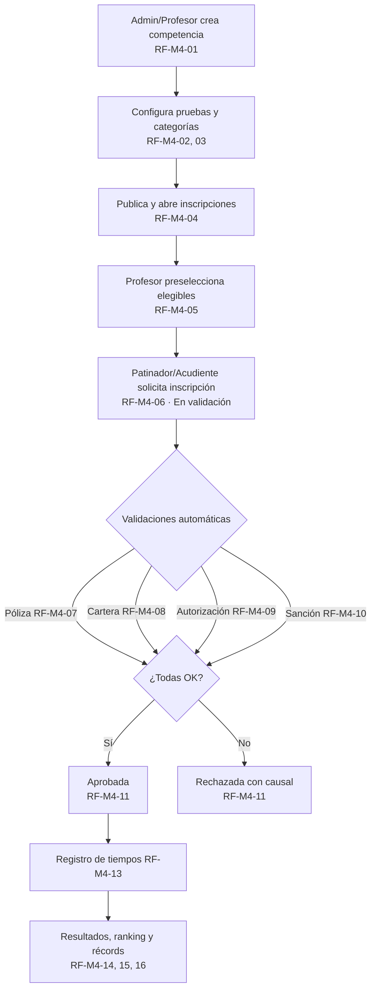

# Plataforma de gestión para escuela de patinaje

> Proyecto académico · Fundamentos de Ingeniería de Software · Universidad Distrital Francisco José de Caldas
> Especificación basada en **ISO/IEC/IEEE 29148:2018**

| Campo | Valor |
|---|---|
| Nombre del proyecto | *(sin definir en el documento; pendiente)* |
| Institución | Universidad Distrital Francisco José de Caldas, Facultad de Ingeniería |
| Asignatura | Fundamentos de Ingeniería de Software |
| Docente | Jaime Fernando Pérez González |
| Equipos | Grupo 1, 2, 3, 4 y 5 |
| Documento fuente | *Lista de Requerimientos Final* v1.0 (21/09/2026) |
| Requisitos funcionales | **77**, todos en estado *Propuesto* |

Detalle y trazabilidad de los requisitos: [`REQUIREMENTS.md`](./REQUIREMENTS.md)

---

## 1. Contexto del proyecto

Una escuela (club) de **patinaje de velocidad** necesita una plataforma web para reemplazar su gestión manual. Hoy el dueño del club concentra procesos que el sistema debe cubrir:

- **Deportivo:** patinadores, niveles técnicos, categorías, evaluación de habilidades e historial.
- **Operativo:** sedes, grupos con cupo, horarios y calendario.
- **Competitivo:** creación de competencias, inscripciones con validaciones, tiempos y rankings.
- **Financiero:** planes, tarifas, cobros mensuales, pagos manuales, cartera y comprobantes.
- **Administrativo:** personal, reportes, y control de uniformes (venta y préstamo).

Muchos patinadores son **menores de edad**, por lo que el **acudiente** es un actor central: autoriza, paga y consulta en nombre del patinador.

**Fuera de alcance (según los requisitos):** pagos en línea o pasarelas de pago (RF-M5-09) y facturación electrónica (RF-M5-14). Los pagos se registran siempre de forma manual.

**Fuentes de los requisitos:** levantamiento con el propietario de la escuela, entrevista con contabilidad, reglamentación deportiva de patinaje de velocidad, manual de convivencia y reglamento interno del club.

---

## 2. Actores y roles

| Rol | Descripción | Alcance principal |
|---|---|---|
| **Administrador** | Gestiona toda la operación de la escuela | Todos los módulos |
| **Profesor** | Entrena, evalúa y propone cambios de categoría | M1, M2, M3, M4 |
| **Patinador** | Consulta su progreso, selecciona grupo, se inscribe a pruebas | M1 a M5 (consulta; gestión solo si es mayor de edad) |
| **Acudiente** | Actúa por el patinador menor de edad | M1 a M5 |
| **Contador** | Acceso financiero de consulta, registro de pagos y reportes | M4-08, M5, M6 |
| **Fisioterapeuta** | Interviene en la validación de póliza médica | M4-07 |
| **Visitante** | Solo información general de la escuela, sin datos de patinadores | M1 |
| **Sistema** | Procesos automáticos (validaciones, cobros, cartera, rankings) | M4, M5 |

---

## 3. Módulos

| Módulo | Nombre | RF | Autores | Qué resuelve |
|---|---|---:|---|---|
| **M1** | Usuarios y Acceso | 3 | D. Martínez, C. Bonilla | Registro, autenticación por rol, autorización de menores, activación de profesores |
| **M2** | Gestión deportiva de patinadores | 23 | L. Cubillos, K. Garzón, J.P. González | Fichas de patinadores, niveles, categorías, evaluación, historial, vistas por rol |
| **M3** | Grupos, horarios y programación | 6 | Grupo 2 | Sedes, grupos con aforo, profesores por grupo, horarios, cambio de grupo, calendario |
| **M4** | Competencias y Resultados | 19 | Grupo 5 | Competencias, pruebas, inscripciones validadas, tiempos, resultados, rankings, récords |
| **M5** | Planes, Tarifas y Pagos | 18 | J. Celis | Planes, tarifas, cobros mensuales, pagos manuales, cartera, comprobantes |
| **M6** | Administración, Reportes, Finanzas e Inventario | 8 | S. Charry, B. Garcés, A. Junco, S. Mendivelso | Panel general, personal, rol Contador, reportes, uniformes |

### Dependencias entre módulos

Lectura: `A --> B` significa que B depende de A. M1 (autenticación y roles) es la base de todo. M5 alimenta a M4 con el estado de cartera. M5 y M6 se necesitan mutuamente (permisos del Contador ↔ pagos y reportes).

---

## 4. Reglas de negocio transversales

1. **Menores de edad:** requieren acudiente asociado, autorización y póliza vigente (RF-M1-02). No pueden confirmar por sí mismos cambios de grupo, inscripciones ni planes (RF-M3-05, RF-M4-06, RF-M5-06).
2. **Inscripción a competencias:** se ratifica solo si pasan cuatro validaciones automáticas: póliza (menores), cartera al día, autorización del acudiente (menores) y ausencia de sanción. No hay aprobación manual (RF-M4-11).
3. **Cartera:** estados `Al día`, `Pendiente` y `Vencido`. `Vencido` bloquea inscripciones a competencias (RF-M5-12, RF-M4-08).
4. **Pagos:** registro manual, sin edición ni eliminación. Las correcciones se hacen anulando con motivo (RF-M5-09, RF-M5-11).
5. **Sin borrado físico:** competencias con inscripciones, planes con patinadores, uniformes con movimientos y préstamos activos no se eliminan, solo se desactivan o anulan.
6. **Auditoría:** cambios de tarifas, correcciones de resultados y anulaciones guardan usuario, fecha y motivo (RF-M5-04, RF-M4-18, RF-M5-11).
7. **Aforo:** un grupo bloquea matrículas al llegar al cupo y alerta al 90 % (RF-M3-02).
8. **Permisos por rol:** el Contador consulta y exporta información financiera pero no modifica usuarios, grupos, horarios, matrículas ni inventario (RF-M6-03).
9. **Privacidad:** el acudiente solo ve a sus patinadores asociados; el patinador solo ve sus propios datos; los rankings solo son visibles para la misma categoría y el personal técnico.
10. **Moneda y formato:** valores en COP; tiempos de competencia en `MM:SS.mmm`.

---

## 5. Flujos clave

### Inscripción a una competencia (M4)

### Ciclo de cobro (M5)

Plan asignado (RF-M5-06) → cobro mensual automático el día 1 (RF-M5-08) → pago manual (RF-M5-09/10) → comprobante (RF-M5-14) → estado de cartera recalculado (RF-M5-12) → consulta por rol (RF-M5-13/16/17/18).

---

## 6. Glosario

| Término | Significado en el proyecto |
|---|---|
| **Nivel** | Conocimiento técnico del patinador en patinaje (lo evalúa el profesor) |
| **Categoría** | Agrupación del club a la que se asigna el patinador según su nivel; en competencias se asocia a edad y género |
| **Grupo** | Clase concreta con sede, frecuencia semanal, horario, profesor(es) y cupo |
| **Prueba** | Modalidad y distancia dentro de una competencia (200 m, 500 m, 1000 m, eliminación, relevos) |
| **Póliza** | Seguro médico obligatorio y vigente para patinadores menores de edad |
| **Plan** | Oferta comercial: día único, 3 días/semana, 6 días/semana o 6 días + gimnasio |
| **Cobro** | Obligación generada por el sistema (mensual o por sesión) |
| **Cartera** | Estado de pago del patinador: Al día, Pendiente o Vencido |

---

## 7. Convenciones del repositorio

- **IDs de requisitos:** `RF-M{módulo}-{consecutivo}`, por ejemplo `RF-M4-11`. El ID no cambia durante el proyecto y se usa para enlazar diseño, código y pruebas.
- **Prioridad:** la escala original mezcla Alta/Media/Baja con MoSCoW (Must/Should). Ver [observaciones](./README_REQUERIMIENTOS.md#7-observaciones-y-puntos-abiertos).
- **Métodos de verificación:** Prueba (T), Demostración (D), Inspección (I), Análisis (A).
- **Siguiente paso:** definir *skills* para agentes (`.agents/skills/`) y construir el design system a partir de la trazabilidad de [`README_REQUERIMIENTOS.md`](./README_REQUERIMIENTOS.md).
