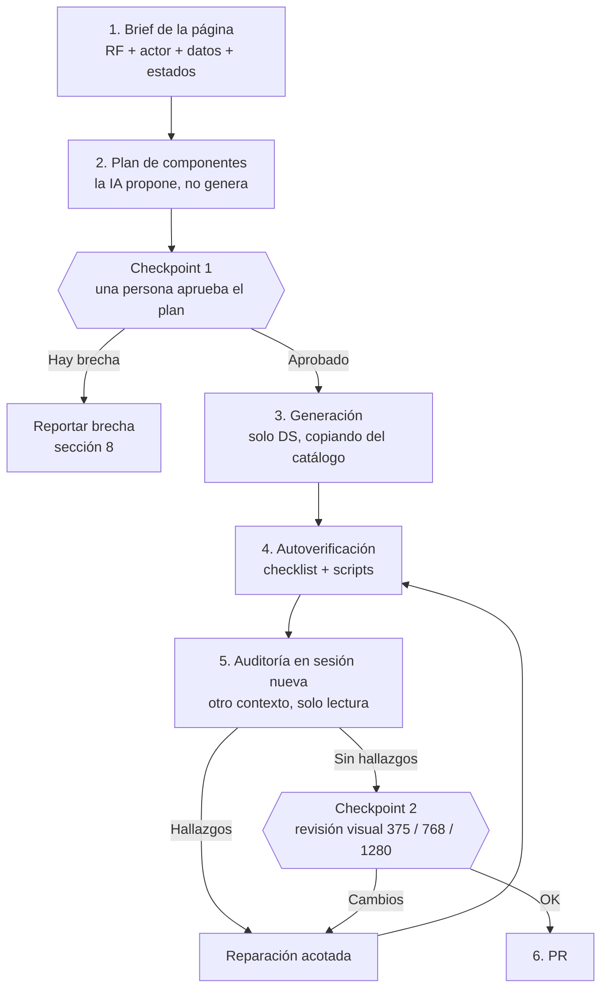

# Guía: wireframes coherentes con IA usando el Design System

> Para quién: los 5 grupos que prototipan los módulos M1 a M6 **con ayuda de un agente de IA** (opencode, Claude Code u otro).
> Objetivo: que, aunque cada grupo, cada persona y cada sesión de IA trabaje por separado, **todas las pantallas se vean y se comporten como del mismo producto**.

| Pieza | Ruta |
|---|---|
| Fuente de verdad del diseño (skill) | `.agents/skills/DesignSystem/` |
| Implementación en código | `design-system/` |
| Spec de implementación | `docs/specs/design-system.md` |
| Ejemplo de referencia | `docs/example/login.html` |
| Requisitos | `REQUIREMENTS.md` |

---

## 1. En 30 segundos

**La IA no tiene gusto propio ni memoria entre sesiones: hace lo más probable.** Sin límites, cada sesión inventará colores, botones y formas distintas. La coherencia no se logra pidiéndole que «se vea bien», se logra **quitándole libertad en lo visual y dándosela en lo funcional**.

La estrategia tiene cuatro palancas y dos puntos de control humano:

1. **Contrato único**: el DS (tokens + catálogo de componentes) es lo *único* que la IA puede usar para lo visual.
2. **Espacio de salida acotado**: la IA solo *compone* piezas existentes; no crea estilos.
3. **Anclaje con ejemplos**: la IA copia marcado probado (catálogo y ejemplo), no lo reescribe.
4. **Verificación**: autoverificación de la IA, auditoría en una sesión distinta y revisión visual humana.
5. **Checkpoint 1 (antes de generar)**: una persona aprueba el *plan de componentes*.
6. **Checkpoint 2 (antes del PR)**: una persona revisa el resultado en 375, 768 y 1280.

> **Regla de oro:** si el agente va a escribir un color, tamaño, espaciado o tipografía que no es un token, o va a dibujar algo que ya está en el catálogo, **debe detenerse**: casi seguro ya existe. Se instancia, no se redibuja.

---

## 2. Por qué la IA rompe la coherencia (y qué lo contiene)

| Lo que la IA hace por defecto | Efecto en el proyecto | Lo que lo contiene |
|---|---|---|
| Inventa colores y tamaños («un azul bonito») | `Vencido` en rojo en M5 y en naranja en M6 | Solo tokens de capa 2; estados solo con `StatusBadge` |
| Reescribe un botón cada vez | Cinco botones distintos | Copiar el marcado del catálogo |
| Trae librerías o clases que conoce (Tailwind, Bootstrap) | Estilos que no son del DS | Lista de prohibiciones y script de verificación |
| Inventa componentes o clases con nombre plausible (`ps-button-primary`) | Clases que no existen y no se ven | Verificar que cada `ps-*` exista en `design-system/` |
| Empieza de cero en cada sesión | Cada pantalla se ve distinta de la anterior | Instrucción de arranque + lectura obligatoria de la skill |
| Prioriza escritorio | Móvil roto o ausente | Entrega obligatoria en 375 y 1280 |
| Rellena con *lorem ipsum* y datos genéricos | Pantallas que no se pueden evaluar | Contenido realista del dominio exigido en el brief |
| Usa verbos y formatos genéricos («Eliminar», `$85,000.00`) | Lenguaje incoherente con las reglas del negocio | Verbos *Anular/Desactivar*; formatos desde `js/format.js` |
| Resuelve un hueco improvisando | Piezas «temporales» que se vuelven permanentes | Protocolo de brechas (sección 8) |

---

## 3. El flujo, de principio a fin



| Paso | Quién | Qué pasa | Salida |
|---|---|---|---|
| 1. Brief | Persona | Llena la plantilla de la sección 5.2 con un RF de `REQUIREMENTS.md` | Brief |
| 2. Plan | IA | Dice qué componentes usará por cada necesidad del RF y por qué; marca lo que no encuentra | Plan (sin código) |
| Checkpoint 1 | Persona | Aprueba o corrige el plan. **Aquí es barato corregir** | Plan aprobado |
| 3. Generación | IA | Construye la página componiendo el DS, copiando del catálogo | `wireframes/grupo-XX/<pagina>/` |
| 4. Autoverificación | IA + scripts | Recorre el checklist de la sección 7 y corrige lo que falle | Informe breve |
| 5. Auditoría | IA, **sesión nueva** | Revisa sin modificar; reporta hallazgos con archivo y línea | Lista de hallazgos |
| Checkpoint 2 | Persona | Mira la página real en los tres anchos | Aprobación o cambios |
| 6. PR | Persona | Sube con capturas y README | PR |

**Por qué el plan va antes del código:** si el agente se equivoca al *elegir* un componente, el error se arrastra a toda la página. Corregir una línea de plan cuesta un mensaje; corregir una página generada cuesta una sesión.

**Por qué la auditoría va en una sesión distinta:** quien generó la página tiene sus mismas suposiciones y tiende a darlas por buenas. Un contexto limpio, con solo la skill y la página, ve lo que el generador no.

---

## 4. Qué lee la IA y en qué orden

Cargar todo siempre desperdicia contexto y diluye las reglas. La skill está organizada para cargarse por capas:

| Cuándo | Qué lee | Para qué |
|---|---|---|
| **Siempre, al empezar** | `SKILL.md` | Alcance, reglas, decisiones base, flujo y definición de terminado |
| Siempre, al empezar | `docs/example/login.html` | Estructura de página de referencia |
| Al elegir componentes (paso 2) | `references/components.md` | Qué componentes existen, variantes y estados |
| Cuando hay estados, formatos o verbos | `references/status-and-formats.md` | Estado → tono, `MM:SS.mmm`, COP, fechas |
| Al generar cada componente | `design-system/catalog/<componente>.html` | **Marcado exacto para copiar** y contrato de atributos |
| Solo si necesita un token | `references/tokens.md` | Nombre y valor de tokens |

No hace falta que lea `components/*/*.css` ni `js/*.js`: son implementación, no contrato.

---

## 5. Prompts listos para pegar

### 5.1 Instrucción de arranque
Pégala al abrir la sesión, o ponla en el archivo de instrucciones permanentes de tu herramienta (por ejemplo `AGENTS.md`) para que no dependa de que alguien la recuerde.

```text
Vas a construir wireframes de la plataforma de la escuela de patinaje usando
EXCLUSIVAMENTE su Design System.

Antes de escribir nada:
1. Lee .agents/skills/DesignSystem/SKILL.md completo.
2. Lee docs/example/login.html como referencia de estructura de página.

Reglas:
- Usa solo elementos y clases ps-* que existan en design-system/, y solo tokens
  de capa 2. Copia el marcado desde design-system/catalog/<componente>.html; no
  lo reescribas ni lo "mejores".
- Prohibido: estilos en línea, colores/tamaños/fuentes literales, librerías CSS
  externas, emojis como íconos, componentes o clases inventados.
- Los estados se muestran con StatusBadge (entity + status). Nunca elijas un
  color para un estado.
- Verbos: Anular o Desactivar, nunca Eliminar. Textos en español, estilo oración.
- Contenido realista del dominio, sin lorem ipsum.
- Entrega móvil (375) y escritorio (1280) y verifica 768.
- Si falta un componente o token, NO lo inventes: detente y repórtalo con el
  formato de brecha.
- Antes de generar, muestra tu plan de componentes y espera mi aprobación.
```

### 5.2 Brief de página

```text
Página: <nombre>            Módulo: M?     Grupo: ?
RF: M?-?? <pega la fila de REQUIREMENTS.md: nombre, actores, tipo, dependencias>
Actor que la ve: <rol>
Qué ve y qué NO ve ese actor (privacidad): <...>
Objetivo de la pantalla en una frase: <...>
Datos que muestra o captura, con ejemplos reales: <p. ej. Sofía Ramírez, $ 85.000>
Estados a cubrir (de status-and-formats.md): <p. ej. cartera Al día / Pendiente / Vencido>
Acción principal y acciones secundarias: <...>
Salida: wireframes/grupo-XX/<pagina>/
Primero entrégame el plan de componentes; no generes aún.
```

### 5.3 Auditoría (en sesión nueva)

```text
Actúa como revisor del Design System. NO modifiques archivos.
Lee .agents/skills/DesignSystem/SKILL.md y audita wireframes/grupo-XX/<pagina>/.
Reporta por categoría, con archivo y línea, la regla incumplida y la corrección:
1. Valores literales (colores, px, fuentes) y estilos en línea.
2. Clases o elementos ps-* que no existan en design-system/.
3. Componentes redibujados a mano en vez de instanciados.
4. Estados sin ícono + texto, o con tono distinto al catálogo.
5. Verbos y formatos (Eliminar, moneda, fecha, tiempo).
6. Responsive: ¿se resuelve en 375, 768 y 1280? ¿hay scroll horizontal de página?
7. Accesibilidad: etiquetas visibles, foco, áreas tocables.
8. Contenido placeholder o genérico.
Si una categoría no tiene hallazgos, dilo explícitamente.
```

### 5.4 Reparación acotada

```text
La página incumple lo siguiente: <pega los hallazgos>.
Corrige SOLO eso, reemplazando por el componente o token del DS que corresponda.
No agregues estilos nuevos ni cambies nada más. Resume los cambios.
```

### 5.5 Reporte de brecha

```text
BRECHA DEL DS
RF:
Pantalla:
Necesidad:
¿Existe con otro nombre? (qué revisé en components.md y en el catálogo):
Componente o token más cercano:
Propuesta (boceto en texto, sin estilos nuevos):
Urgencia (bloquea / puede esperar):
```

---

## 6. Qué puede y qué no puede escribir la IA

**Sí puede**
- HTML de la página, con elementos nativos y componentes del DS.
- Enlazar el DS:
  ```html
  <link rel="stylesheet" href="../../../design-system/ps.css">
  <script type="module" src="../../../design-system/ps.js"></script>
  ```
- Un CSS de página **mínimo y solo de disposición** (centrar una columna, una rejilla, `gap`), usando únicamente tokens y las clases de layout del DS. Es el caso del centrado del login: lo define la página, no el DS.
- Contenido, textos y datos de ejemplo.

**No puede**
- Estilos en línea (`style="…"`) ni reglas que definan color, tipografía, borde, sombra o radio.
- Valores literales: `#…`, `rgb()`, `12px`, `font-size: 14px`.
- Usar tokens de **capa 1** (`--color-*`): solo capa 2.
- Librerías o frameworks CSS externos, ni fuentes ni íconos de CDN.
- Crear clases o componentes nuevos «para esta pantalla».
- Elegir un tono para un estado (lo resuelve `StatusBadge`).
- Definir permisos por rol por su cuenta: los define el equipo en el brief.

---

## 7. Verificación

### 7.1 Checklist de autoverificación (la IA lo recorre en el paso 4; tú lo confirmas en el checkpoint 2)

- [ ] Solo componentes del catálogo y solo tokens de capa 2; ningún `style=` ni valor literal.
- [ ] Todo `ps-*` usado existe en `design-system/`.
- [ ] Estados con ícono + texto; `Anulado/Cancelado` en `neutral`, `Rechazado` en `error`.
- [ ] Verbos *Anular/Desactivar*; copy en español, estilo oración («Al día»).
- [ ] Toda entrada con etiqueta visible; los errores dicen qué corregir.
- [ ] Formatos: `$ 85.000`, `21/09/2026`, `01:23.450`.
- [ ] 375 / 768 / 1280 sin scroll horizontal de página; áreas tocables ≥ 44 px en móvil.
- [ ] Contenido realista del dominio; RF de origen citados.
- [ ] Rol y privacidad: la pantalla muestra solo lo que ese actor puede ver.

### 7.2 Verificación automática

Los `design-system/scripts/check-*.mjs` protegen **el DS en sí** (que los componentes no tengan valores crudos, que `tokens.css` coincida con `tokens.md`, que los contrastes cumplan). **No revisan los wireframes.**

**Mejora de mayor retorno (propuesta):** un `check-wireframe.mjs` sin dependencias, que falle si una página:
- contiene `style="…"` o valores literales en un `<style>`;
- usa una clase `ps-*` que no existe en el CSS del DS, o un `<ps-*>` no registrado en `ps.js`;
- usa `StatusBadge` con una entidad o un estado que no está en `status-catalog.js`;
- contiene «Eliminar» como etiqueta de acción;
- no enlaza `ps.css` / `ps.js` o no declara el *viewport*.

Con ese script, la IA puede ejecutar la verificación sola y repararse antes de pedirte revisión.

### 7.3 Revisión visual humana
Abre la página en 375, 768 y 1280 (con el servidor local de la sección 10) y comprueba lo que un script no ve: jerarquía, aire entre bloques, que se lea como el resto del producto. Ten abierto `docs/example/login.html` al lado: **si tu página parece de otro producto, no está lista.**

---

## 8. Brechas y cambios al DS

**Cuando falta algo**, la IA no improvisa. Se sigue este orden:

1. Confirma que no existe con otro nombre (`components.md`, catálogo).
2. Si de verdad falta, la IA llena el **reporte de brecha** (sección 5.5) y se detiene en esa parte.
3. Si es urgente, usa el componente o token más cercano y deja en el frame la nota visible: «Temporal, pendiente de componente oficial».
4. Quien mantiene el DS decide si se agrega.

**Cuando se agrega o cambia algo oficial**, el orden es siempre:

`skill (contrato)` → `código` → `catálogo` → `aviso a los grupos`

Nunca al revés: si el código cambia primero, la IA seguirá leyendo una skill desactualizada y producirá pantallas que contradicen el código.

Como los wireframes **instancian** componentes y tokens en vez de copiar valores, un cambio del DS se propaga solo; lo que hay que hacer después es volver a pasar la verificación.

---

## 9. Higiene de sesiones con IA

- **Una página por sesión.** Las sesiones largas se desvían: la IA «recuerda» lo que hizo hace diez mensajes y lo prefiere a la skill.
- **Que no copie estilo de otras páginas generadas.** La referencia de estilo es el DS y el catálogo, no el wireframe de otro grupo (puede contener errores).
- **Pega solo lo necesario:** la fila del RF, no todo `REQUIREMENTS.md`.
- **Si la IA se desvía**, no discutas el estilo: repite la regla, o abre una sesión nueva con la instrucción de arranque.
- **Pide siempre el plan antes del código.** Es el hábito que más errores evita.
- **El generador no se audita a sí mismo.** La auditoría va en otra sesión.

### Señales de que la IA se salió del DS

| Señal | Causa probable | Qué hacer |
|---|---|---|
| Aparecen `#…`, `px` o `style=` | Ignoró la regla de oro | Reparación acotada (5.4) |
| Un botón o campo se ve «casi igual» al del catálogo | Lo reescribió | Pedir que lo reemplace por el marcado del catálogo |
| Clase `ps-…` que no hace nada | La inventó | Verificar que exista; si no, es brecha o error |
| Un estado con color propio | No usó `StatusBadge` | Reemplazar por `StatusBadge entity + status` |
| Íconos de emoji o de CDN | Improvisó íconos | Usar `<ps-icon>` con nombres del sprite |
| Solo se ve bien en escritorio | No cubrió móvil | Pedir 375 y revisar 768 |
| Textos como «Lorem ipsum», «Usuario 1» | Brief sin ejemplos reales | Ampliar el brief con datos del dominio |

---

## 10. Ver y usar

**Servidor local** (los módulos ES no funcionan abriendo el HTML con `file://`):

```bash
python3 -m http.server 8000
# Ejemplo:   http://localhost:8000/docs/example/login.html
# Catálogo:  http://localhost:8000/design-system/catalog/
```

**Estructura de entrega** (convención del repo): `wireframes/grupo-XX/<pagina>/`, con nombres de página en minúsculas, sin tildes ni espacios (`inicio/`, `login/`…); capturas `<pagina>.png` y `<pagina>-movil.png` para el PR; un `README.md` con la herramienta usada y las decisiones tomadas (incluye qué componentes se eligieron y qué brechas se reportaron).

**Elegir componentes por tipo de RF:** la tabla «tipo de interacción → componentes de partida» está en `SKILL.md` §2. Es la base del plan del paso 2.

---

## 11. Caso trabajado: M1-01 (login)

RF M1-01: *Registro y autenticación de usuarios por rol*. Actores: Patinador, Acudiente, Profesor, Visitante. Tipo: **Formulario**.

**Plan de componentes que se debió aprobar en el checkpoint 1:**

| Necesidad del RF | Componente | Por qué |
|---|---|---|
| Marco para el Visitante (sin datos de patinadores) | `AppShell` variante pública | Barra superior sin navegación; la nav por rol llega como *slot* |
| Alternar Ingresar / Registrarse | `Tabs` | Dos modos del mismo formulario |
| Correo, contraseña, rol | `FormField` + `TextInput` / `Select` | Tipo Formulario: siempre `FormField` |
| Entrar / Crear cuenta | `Button primary lg`, ancho completo | Acción principal; `lg` en móvil por área tocable |
| Recuperar contraseña | `Link` | Acción secundaria sin peso visual |
| Nota de autorización/póliza del menor | Texto de ayuda del campo rol | Es contexto del campo, no un estado de página |

**Decisiones que el humano corrigió o confirmó:**
- El `Select` de rol lista **solo** los cuatro actores de M1-01. Administrador, Contador y Fisioterapeuta no tienen alta definida (punto abierto 7.1 de `REQUIREMENTS.md`): la IA no debe inventarlo.
- Se quitaron `Breadcrumb` (ruido en un login), un `Alert` de error permanente (un login no amanece en error; el error aparece tras un intento fallido) y toasts de demostración. **Una pantalla, una tarea.**

**Cómo debe verse:** columna estrecha centrada; título `heading-h1` con una línea de contexto; campos en columna con `gap --spacing-md`; botón a ancho completo y enlace centrado debajo. En 375 usa el ancho completo con el margen de página, controles en `--control-height-lg` y pestañas con desplazamiento horizontal, sin scroll horizontal de página. Contenido realista: «Sofía Ramírez», `sofia@example.com`.

---

## 12. Qué mejoraría esta estrategia (propuestas, fuera del DS)

1. **`check-wireframe.mjs`** (sección 7.2): convierte las reglas de texto en verificación automática.
2. **Un ejemplo de referencia por tipo de RF**, además del login: una pantalla de *consulta con tabla y filtros*, una de *formulario con diálogo de confirmación*, una de *ficha de detalle* y una de *panel*. Son los mejores anclajes para la IA porque fijan la **estructura de la página** (dónde va el título, los filtros, las acciones), que es lo que el DS no define y donde más se diferenciarán los grupos si cada IA decide por su cuenta. Viven en `docs/example/`, no en el DS.
3. **Instrucciones permanentes** (`AGENTS.md` o equivalente) con la instrucción de arranque de la sección 5.1, para que ninguna sesión empiece sin ellas.
4. **Una persona responsable del DS por semana** (rotativa) que resuelva brechas y revise PR con un ojo en la coherencia entre módulos.